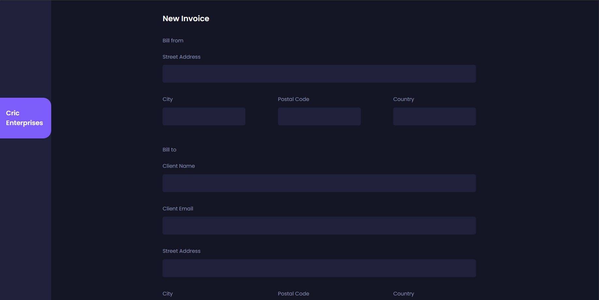
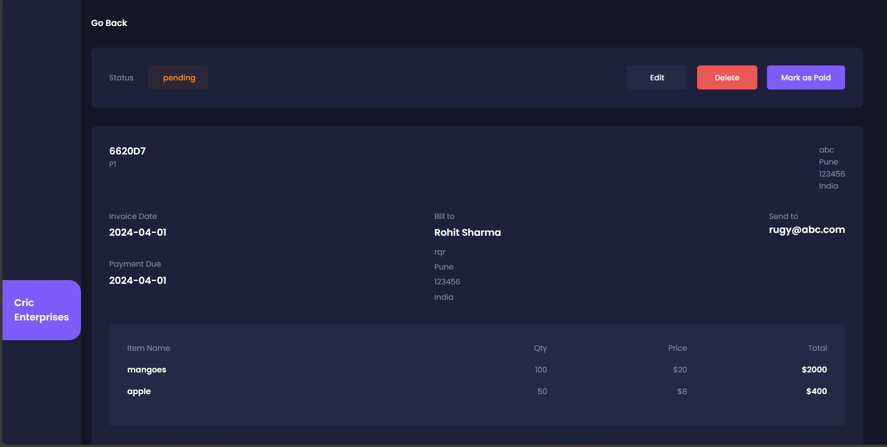
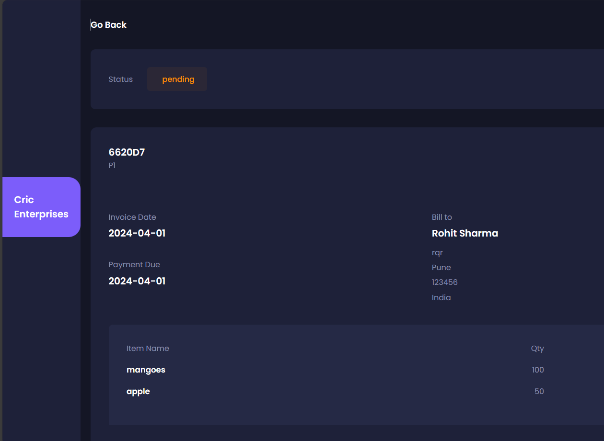

This project involves the development of an invoice application using Next.js for the frontend and MongoDB as the database solution. The application aims to provide a seamless platform for enterprises to create and manage invoices efficiently. Leveraging the features of Next.js, the application will offer a responsive and intuitive user interface for creating, viewing, and updating invoices.

MongoDB will serve as the database to store invoice data, providing scalability and flexibility for managing large volumes of transactions. The application will include functionalities such as categorizing invoices as paid or pending, enabling enterprises to keep track of their financial transactions effectively.

By integrating Next.js and MongoDB, the project aims to deliver a robust and user-friendly invoice application suitable for enterprises of various scales. If you encounter any challenges or require assistance during the development process, support will be readily available.

    
  
  
  

